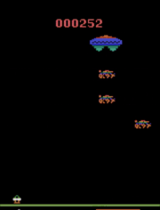
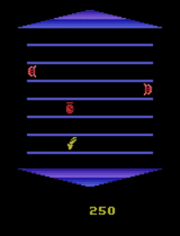
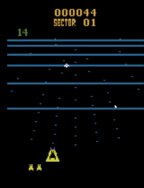

# Playing Atari Games using Neuroevolution

   

## 1. Getting Started

These instructions will get you a copy of the project up and running on your local machine for development and testing purposes.

### 1.1. Prerequisites

You need to have following libraries installed:
```
Python 2.7
OpenAI Gym (with Atari Dependencies)
DEAP
Numpy
Matplotlib
```

## 2. Demo/Quick Start 

1. Go to `code/` folder
    ```
    cd code
    ```

2. Run `evolve.py` script to evolve the agent, like so: 
    ```
    python evolve.py
    ```
    All options are mentioned below: 
    ```
    usage: evolve.py [-h] [--input_dim INPUT_DIM] [--num_hidden NUM_HIDDEN]
                 [--num_actions NUM_ACTIONS] [--init_func INIT_FUNC]
                 [--init_args INIT_ARGS] [--preprocess PREPROCESS]
                 [--preprocess_args PREPROCESS_ARGS]
                 [--population_size POPULATION_SIZE] [--num_gens NUM_GENS]
                 [--crossover_type CROSSOVER_TYPE]
                 [--crossover_prob CROSSOVER_PROB] [--mutate_type MUTATE_TYPE]
                 [--mutate_args MUTATE_ARGS] [--mutate_prob MUTATE_PROB]
                 [--mutate_indpb MUTATE_INDPB] [--select_type SELECT_TYPE]
                 [--num_select NUM_SELECT] [--select_args SELECT_ARGS]
                 [--game_name GAME_NAME] [--num_episodes NUM_EPISODES]
                 [--load LOAD] [--exp_root_dir EXP_ROOT_DIR]
                 [--exp_name EXP_NAME] [--save_every SAVE_EVERY]
                 [--hof_maxsize HOF_MAXSIZE] [--render RENDER]
    ```
    Running this script will generate the following in `[exp-root-dir]/[exp-name]`
    1. `config.txt`: options used to generate this experiment 
    2. `logbook.pkl`: statistics/data of the evolution
    3. `network.pkl`: best evolved network
    4. `plot.png`: graph of evolution

3. Run `play.py` script to let the evolved agent play, like so: 
    ```
    python play.py 
    ```
    All options are mentioned below
    ```
    usage: play.py [-h] [--game GAME] [--num_episodes NUM_EPISODES]
               [--input_dim INPUT_DIM] [--num_hidden NUM_HIDDEN]
               [--num_actions NUM_ACTIONS] [--pretrained PRETRAINED]
               [--preprocess PREPROCESS] [--preprocess_args PREPROCESS_ARGS]
    ```

## References
[1] [Deep Neuroevolution: Genetic Algorithms are a Competitive Alternative for Training Deep Neural Networks for Reinforcement Learning](https://arxiv.org/abs/1712.06567)